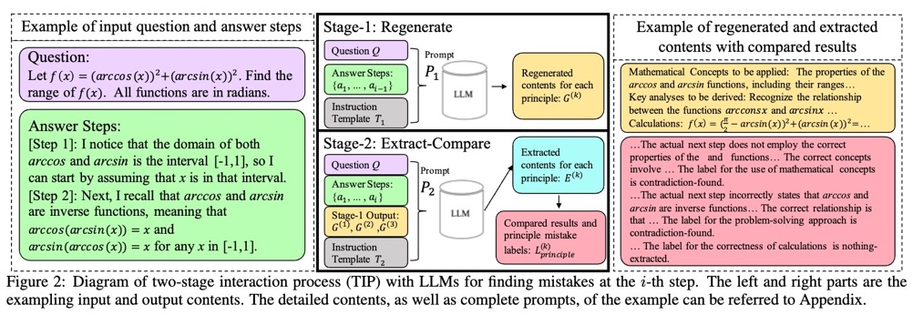
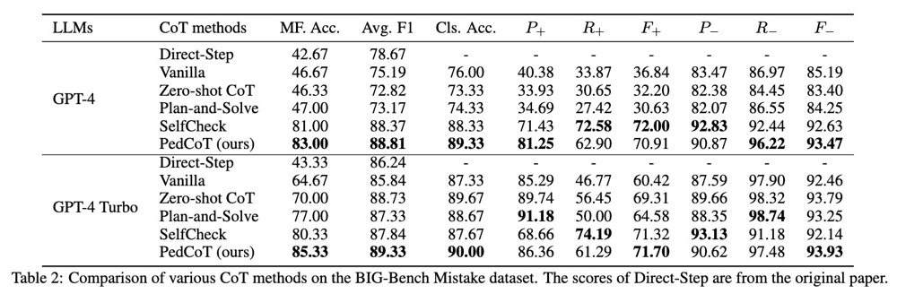
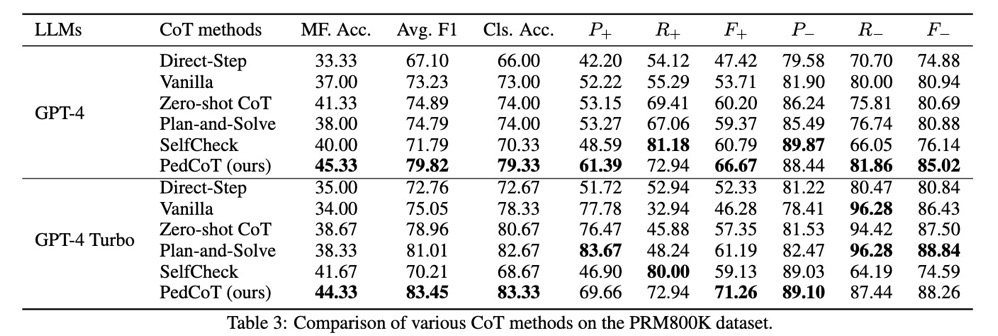

# PedCoT：通过教育学思维链提升大模型检测数学推理错误的能力

## 研究背景
在自然语言处理（NLP）领域，大型语言模型（LLMs）已经取得了令人瞩目的成就。然而，这些模型在生成内容时可能会产生“幻觉”问题，即生成的内容在表面上看似合理，但实际上缺乏逻辑性。为了克服这一难题，研究者们提出了自纠错方法，该方法通过零样本（zero-shot）或少样本（few-shot）提示来纠正LLMs的输出。尽管这是一个有前景的研究方向，但现有的研究表明，LLMs在使用简单的提示策略时，很难可靠地识别出推理错误。

## 研究亮点
本研究提出的PedCoT策略，是一种结合了教育理论的新颖提示方法，它通过设计符合教育原则的提示（Pedagogical Principles for Prompts，简称PPP），以及一个两阶段的互动过程（Two-stage Interaction Process，简称TIP），来引导LLMs识别数学推理中的错误。这一策略的提出强调了教育理论作为领域知识，在引导设计提示策略以有效应对LLMs面临的具有挑战性任务方面的重要性。

## 研究方法
PedCoT策略的核心在于其三个组成部分：

1. PPP设计：研究者们根据布鲁姆认知模型（Bloom Cognitive Model，简称BCM）的学习能动性层次，提出了与学习能动性一致的提示设计原则。这些原则旨在帮助LLMs更好地理解和应用数学概念。
2. TIP：这一过程包括两个阶段——重新生成（Regenerate）和提取比较（Extract-Compare）。在重新生成阶段，LLMs被要求基于给定的数学问题和先前的答案步骤，重新生成潜在的数学概念和关键分析。在提取比较阶段，LLMs则需要从当前答案步骤中提取实际的数学概念和问题解决策略，并与重新生成的内容进行比较。
3. 基于教育理论的提示：研究者们设计了一系列与TIP阶段相协调的提示，这些提示使LLMs能够在每一步中进行准确的二元评估，并提供有教育意义的文本反馈，从而桥接了教育理论与LLMs的提示设计之间的差距。

## 实验结果
在这篇论文中，研究者们使用了一组特定的指标来评估和比较不同方法在发现数学推理错误方面的性能。以下是用于评估的主要指标：
- Mistake Finding Accuracy (MF. Acc.)：这是一个严格的指标，用于衡量模型在步骤级别上准确发现错误的能力。它只关注在给定答案序列中首次出现的错误是否被正确识别。
- Average F1 Score (Avg. F1)：这是一个宽松的指标，用于衡量模型在整个答案序列上识别错误的能力。它考虑了答案序列中所有可能的错误，而不仅仅是第一个错误。
- Classification Accuracy (Cls. Acc.)：这个指标衡量的是模型对每个答案步骤进行二分类（正确或错误）的准确度。
- Precision (P+ and P−)：Precision 衡量的是模型正确识别为“正确”的答案步骤中，实际上确实是正确的比例（P+）和错误地识别为“正确”的实际错误答案步骤的比例（P−）。
- Recall (R+ and R−)：Recall 衡量的是所有实际正确的答案步骤中，被模型正确识别出来的比例（R+）和所有实际错误的答案步骤中，被模型错误地忽略的比例（R−）。
- F1 Score (F+ and F−)：F1 分数是 Precision 和 Recall 的调和平均数，用于衡量模型的整体性能。对于正确（F+）和错误（F−）的答案步骤，都会有相应的 F1 分数。

通过这些指标，研究者们能够全面评估不同提示策略在引导LLMs进行数学错误检测时的性能。这些指标不仅提供了对模型性能的定量评估，还揭示了模型在特定类型的错误检测任务上的潜力和局限性。在论文的实验部分，研究者们使用这些指标来比较PedCoT策略和其他基线方法，如Zero-shot CoT、Plan-and-Solve Prompting和SelfCheck等。通过这些比较，研究者们得出了PedCoT策略在数学推理错误检测任务上的优越性。

研究者们在两个公开的数学问题数据集上进行了实验，包括BIG-Bench Mistake和PRM800K。实验结果显示，在包括GPT-4和GPT-4 Turbo的不同大模型上，PedCoT策略在零样本提示下显著优于强基线方法，包括Direct-Step Prompting、Vanilla Two-stage Prompting、Zero-shot CoT、Plan-and-Solve Prompting和SelfCheck。这些结果不仅证实了PedCoT策略的有效性，也展示了LLMs在经过适当提示后，能够可靠地识别数学推理错误。

PedCoT策略的成功在于其能够引导LLMs通过教育理论的框架进行思考。通过模拟教育过程中的分析过程，LLMs能够更好地理解和分析数学问题，从而识别出逻辑上的错误。此外，两阶段的互动过程确保了LLMs在没有当前答案步骤的情况下进行判断，这有助于减少偏差，提高判断的公正性。

## 研究意义
这项研究的意义在于它不仅提高了LLMs在解决数学问题时的准确性，还为如何利用领域知识设计有效的提示策略提供了新的视角。通过教育理论的应用，研究者们展示了如何更有效地引导LLMs的推理能力，这对于大模型在教育技术领域的应用具有重要的启示作用。